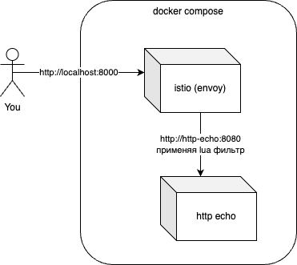

### Project Outline

### How to Test Your Lua Script Using Envoy

1. Insert your Lua script after the `inline_code` line in the [`envoy.yaml`](envoy.yaml)
2. Up the project using command: `docker compose up -d`
3. Send an HTTP request to the http://localhost:8000 and in response, you will receive the information in the specified format after processing by the Lua
   > By default, Lua adds the `lua-worked: true` HTTP header
